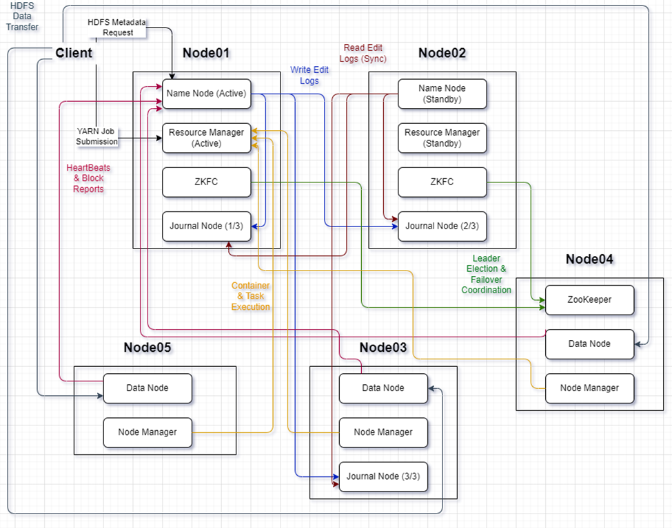
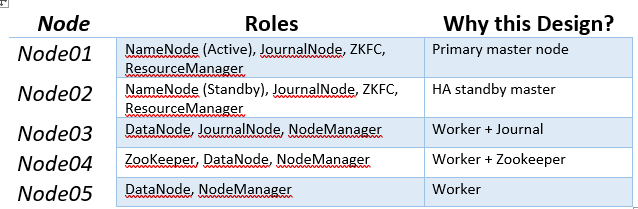

# Hadoop HA Cluster Documentation 
(Docker-Based)

# 1.	Cluster Architecture Overview
This project builds a High Availability (HA) Hadoop Cluster using Docker containers.

•	HDFS High Availability (2 NameNodes)

•	JournalNodes (3 nodes)

•	ZooKeeper-based automatic failover

•	YARN High Availability (2 ResourceManagers)

•	3 DataNodes

•	1 ZooKeeper node

# 2.	Nodes & Roles Distribution

# 3. HDFS High Availability Design
NameNodes

•	node01 --> nn1

•	node02 --> nn2

Why?

•	Prevents single point of failure

•	If Active NN fails -> Standby becomes 
Active automatically

JournalNodes (Quorum: 3 nodes)

Running on:

•	node01

•	node02

•	node03

Why 3?

•	Quorum-based system requires odd number

•	Majority (2/3) needed for consistency

•	Prevents split-brain problem

Shared edits:
qjournal://node01:8485;node02:8485;node03:8485/hadoopproject

ZooKeeper & ZKFC

•	ZooKeeper runs on node04

•	ZKFC runs on node01 & node02

ZooKeeper responsibilities:

•	Leader election

•	Failover coordination

•	Lock management

# 4. Data Layer (Storage)
DataNodes:

•	node03

•	node04

•	node05

Why 3 DataNodes?

•	Distributed storage

•	Block replication (but in the project description we was asked to set the replication factor = 1)

•	Fault tolerance

•	Parallel processing

# 5. YARN High Availability
I have implemented:

•	ResourceManager HA

•	2 RMs:

    o	rm1 -> node01

    o	rm2 -> node02

•	ZooKeeper-based leader election

NodeManagers run on:

•	node03

•	node04

•	node05

Why this design?

•	Prevents YARN master failure

•	Applications continue running even if one RM fails

# 6. Docker Architecture Design
Network

Custom bridge network:

172.30.0.0/16

Static IP assignment:

•	Ensures predictable communication

•	Required for HA configuration

•	Avoids DNS resolution issues

# 7. Startup Logic Design
You used a role-based startup script:

case $HOST in

Advantages:

•	Same Docker image for all nodes

•	Role determined by hostname

•	Clean, reusable design

•	Automated formatting logic

•	Automatic standby bootstrap

# 8. Master vs Worker Separation
Master Layer

•	node01

•	node02

Handles:

•	Metadata

•	Scheduling

•	Cluster coordination

Worker Layer

•	node03

•	node04

•	node05

Handles:

•	Block storage

•	Task execution

•	Shuffle processing

# 9. Fault Tolerance Mechanisms
FAILURE	WHAT HAPPENS?

ACTIVE NN CRASHES --> Standby promoted automatically

RESOURCEMANAGER FAILS --> Other RM becomes active

DATANODE FAILS --> Blocks re-replicated

JOURNALNODE FAILS --> System continues
